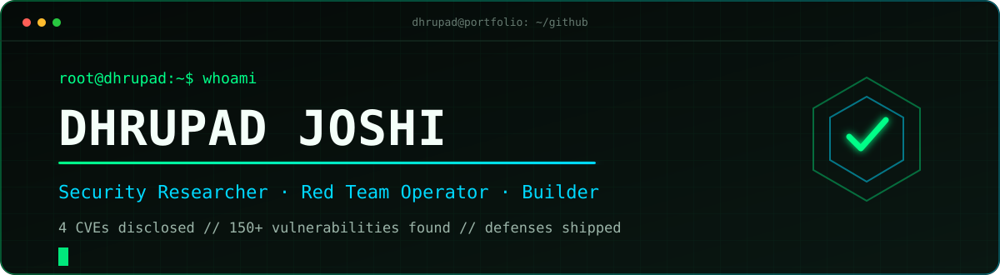

<div align="center">
  
</div>

<div align="center">
  <a href="https://dhrupad.me/"></a>
  <a href="https://v86lab.vercel.app/"></a>
  <a href="https://linkedin.com/in/dhrupad-joshi"></a>
  <a href="mailto:joshidhrupad.u@gmail.com"></a>
</div>

```text
root@dhrupad:~$ whoami
Security researcher working the full attack-to-defense loop.

root@dhrupad:~$ cat mission.txt
Break systems responsibly. Turn findings into detections. Build tools that help defenders win.
```

## `// signal, not noise`

| **150+** vulnerabilities found | **4** published CVEs | **12×** Hall of Fame | **Top 3** MACCDC 2026 |
|:---:|:---:|:---:|:---:|
| Responsible disclosure | HAX CMS research | Industry recognition | Collegiate cyber defense |

I work across offensive security, vulnerability research, detection engineering, AppSec, cloud security, DFIR, and AI/LLM red teaming. I like the hard middle ground where a finding becomes a reproducible attack path, a useful detection, and eventually a better product.

## `// flagship builds`

<table><tr>
<td width="50%" valign="top">
<h3><a href="https://github.com/trigerman/eyilguard">01 / Eyil Guard</a></h3>
<p><strong>Open-source Windows endpoint protection with transparent verdicts.</strong></p>
<p>Combines ClamAV, ~5,900 YARA rules, abuse.ch intelligence, behavioral heuristics, live C2/hash checks, and a kernel minifilter for pre-execution blocking.</p>
<p><code>Python</code> <code>React</code> <code>YARA</code> <code>Minifilter</code> <code>Threat Intel</code></p>
<a href="https://github.com/trigerman/eyilguard"><strong>Explore the repository →</strong></a>
</td>
<td width="50%" valign="top">
<h3><a href="https://v86lab.vercel.app/">02 / Browser Cyber Labs</a></h3>
<p><strong>Real Linux attack-and-defense labs running entirely in the browser.</strong></p>
<p>v86 + WebAssembly ranges with no backend grader or local VM. BlueWall teaches IDS/firewall response; ShadowShell teaches webshell incident response. Each run rewrites the evidence.</p>
<p><code>v86</code> <code>WebAssembly</code> <code>Buildroot</code> <code>Snort</code> <code>DFIR</code></p>
<a href="https://v86lab.vercel.app/"><strong>Launch the labs →</strong></a>
</td>
</tr></table>

## `// published vulnerability research`

| ID | Severity | Research |
|---|:---:|---|
| [CVE-2026-46396](https://nvd.nist.gov/vuln/detail/CVE-2026-46396) | `CRITICAL · 9.3` | Stored XSS via iframe injection in HAX CMS |
| [CVE-2026-46496](https://nvd.nist.gov/vuln/detail/CVE-2026-46496) | `CRITICAL · 9.3` | Stored XSS via the HAX CMS video-player component |
| [CVE-2026-46511](https://nvd.nist.gov/vuln/detail/CVE-2026-46511) | `HIGH · 8.7` | Stored XSS + token exposure account-takeover path |
| [CVE-2026-35185](https://nvd.nist.gov/vuln/detail/CVE-2026-35185) | `HIGH · 8.7` | Public server-status sensitive information exposure |

All four issues were responsibly disclosed and patched upstream. [Read the full research and impact notes →](https://dhrupad.me/#research)

## `// operating range`

```text
OFFENSE              DEFENSE                 ENGINEERING
├─ Red teaming       ├─ Detection-as-code    ├─ Python / TypeScript
├─ Web & API testing ├─ Threat hunting       ├─ Security tooling
├─ Adversary emu     ├─ DFIR                 ├─ v86 / WebAssembly
├─ AI / LLM security ├─ Incident response    └─ Cloud & AppSec
└─ Vuln research     └─ Purple teaming
```

## `// field notes`

- Penn State — M.S. Cybersecurity Analytics & Operations, **3.96 GPA**
- Top 3 — Mid-Atlantic Collegiate Cyber Defense Competition 2026
- 16th of ~100 teams — DOE CyberForce Competition 2025
- Hall of Fame recognition from organizations including SAP and Mastercard

<div align="center">
  
  
</div>

<br />

<div align="center">
  <strong>Open to security roles, research collaboration, and ambitious defensive engineering.</strong><br />
  <sub><code>root@dhrupad:~$</code> make security useful <span>█</span></sub>
</div>
